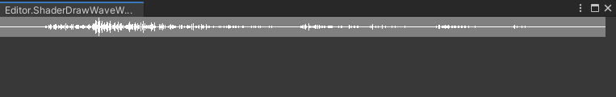

# DrawWave

This  is repository for draw wav file to a wave texture.Use cpu,shader,compute shader three methods to draw.

## Doc

# Reference

Get WAV audio data use [respository](https://github.com/SuperSuperPepper/UnityWav)

